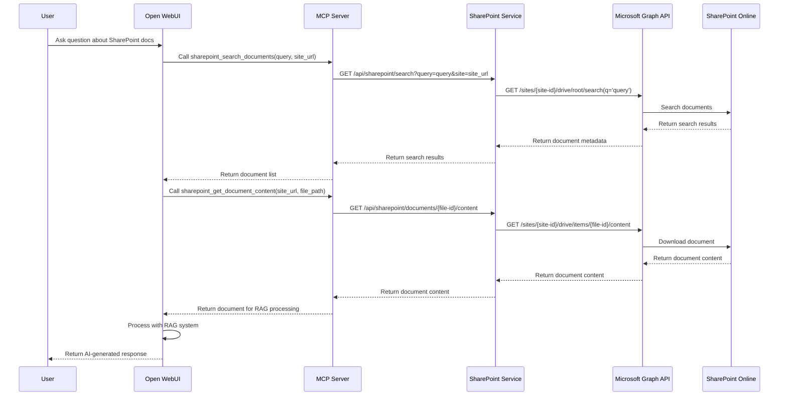
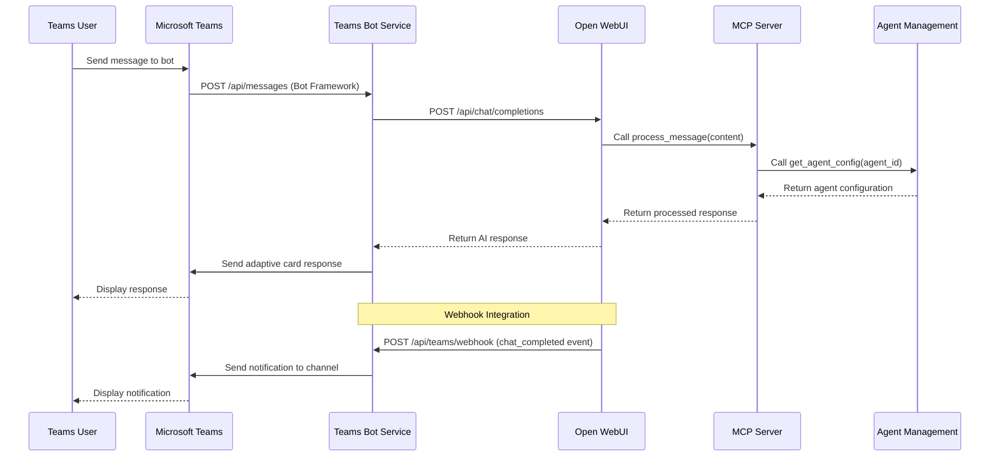
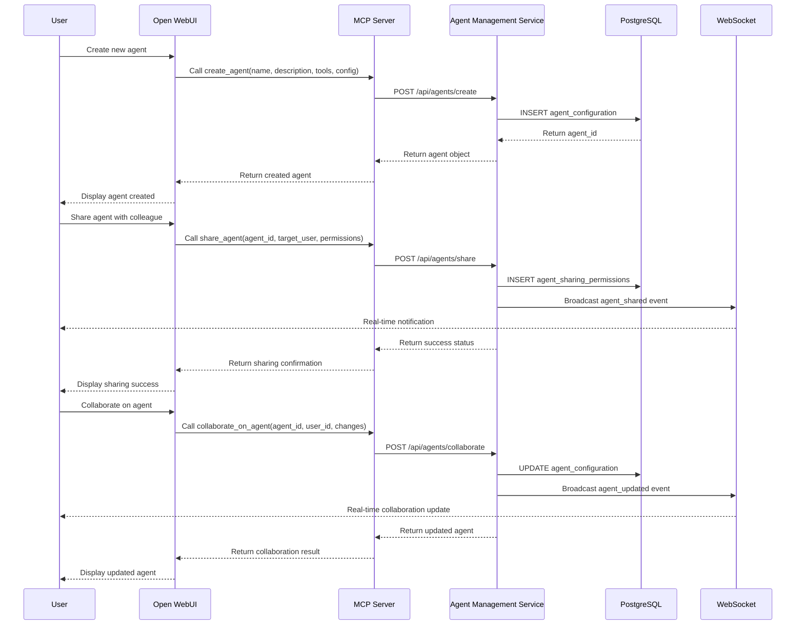
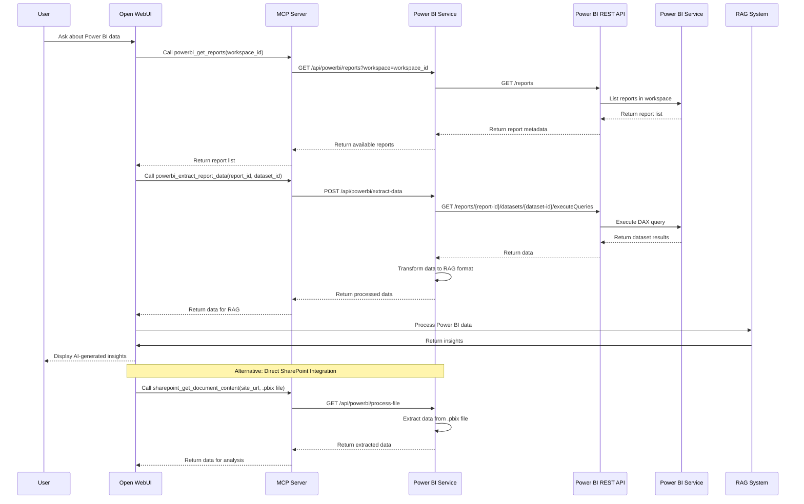
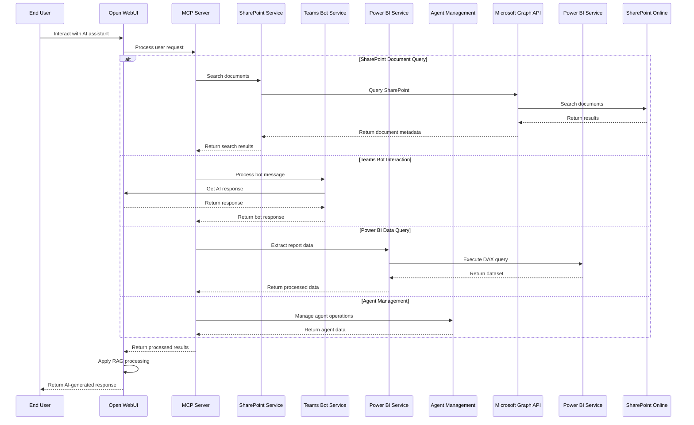
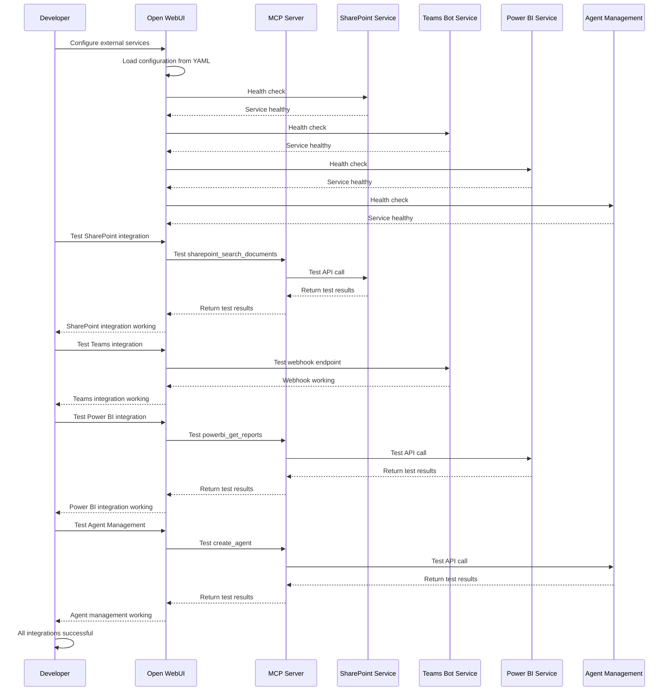

# Open WebUI Microsoft 365 Integration Requirements Plan

## Executive Summary

This plan outlines the implementation strategy for integrating Open WebUI with Microsoft 365 services (SharePoint, Teams, Power BI) while leveraging modern architectures including MCP (Model Context Protocol) and A2A (Agent-to-Agent) protocols. The plan is designed for a team with expertise in Go, Python, and Java Spring Boot.

## Integration Strategy: External Services Approach

### Why External Services?
- **Preserve Open Source Updates**: Keep Open WebUI unmodified for easy upstream updates
- **Modular Architecture**: Independent services that can be deployed separately
- **Technology Flexibility**: Use best-suited languages for each integration
- **Maintenance Isolation**: Changes to integrations don't affect core Open WebUI
- **Scalability**: Services can be scaled independently

### Current Open WebUI Architecture Analysis

#### Core Components
- **Backend**: FastAPI-based Python application with modular router architecture
- **Frontend**: Svelte-based progressive web application
- **Database**: SQLAlchemy with support for multiple databases
- **Real-time**: WebSocket-based communication via Socket.IO
- **Extensibility**: Pipelines framework for custom integrations
- **Authentication**: Multi-provider OAuth support including Microsoft Entra ID

#### Existing Microsoft 365 Integration Points
- **OneDrive/SharePoint**: Basic configuration support (`ONEDRIVE_SHAREPOINT_URL`, `ONEDRIVE_SHAREPOINT_TENANT_ID`)
- **Teams**: Webhook support for notifications
- **MCP Support**: MCPO (MCP to OpenAPI) integration capability
- **Channels**: Real-time collaboration features (Beta)

#### Integration Methods Available
1. **Pipelines Framework**: Add custom pipelines without modifying core code
2. **OpenAPI Server Integration**: Connect external services via REST APIs
3. **MCPO Integration**: Use MCP servers as OpenAPI endpoints
4. **Webhook Integration**: Leverage existing webhook system
5. **Document Upload**: Use existing document processing capabilities

#### Chosen Integration Strategy
**Primary Method**: **MCPO Integration** (MCP servers as OpenAPI endpoints)
- **Why**: Provides the most seamless integration with Open WebUI's existing pipeline system
- **How**: External MCP servers expose tools that Open WebUI can call via its pipeline framework
- **Benefits**: No code changes to Open WebUI, leverages existing extensibility, supports complex tool interactions

**Secondary Method**: **OpenAPI Server Integration** (REST APIs)
- **Why**: For services that need direct REST API access (Teams webhooks, configuration)
- **How**: External services expose REST APIs that Open WebUI can call directly
- **Benefits**: Simple HTTP communication, easy to implement and test

**Supporting Method**: **Webhook Integration**
- **Why**: For real-time notifications and event-driven interactions
- **How**: Open WebUI sends webhooks to external services for notifications
- **Benefits**: Real-time updates, event-driven architecture

## Requirements Analysis & Implementation Strategy

### Requirement 1: SharePoint Integration

#### Current State
- Basic OneDrive/SharePoint configuration exists
- No direct SharePoint API integration
- RAG system supports document processing

#### Integration Method: MCPO Integration
- **Primary**: MCP Server exposing SharePoint tools
- **Secondary**: REST API for direct service communication
- **Configuration**: Add MCP server to Open WebUI pipelines via admin panel

#### User Experience

**Scenario 1: Document Search and Q&A**
```
User: "What does our Q4 sales report say about the European market?"

Open WebUI Experience:
1. User types question in chat interface
2. Open WebUI automatically detects SharePoint-related query
3. System searches SharePoint documents using MCP tools
4. Relevant documents are retrieved and processed through RAG
5. AI generates comprehensive answer with document citations
6. User sees: "According to the Q4 Sales Report (SharePoint), European market 
   revenue increased 15% compared to Q3, with Germany leading at €2.3M..."
```

**Scenario 2: Document Discovery**
```
User: "Show me all documents about cybersecurity from last month"

Open WebUI Experience:
1. User requests document list
2. System queries SharePoint using MCP tools
3. Returns formatted list of documents with metadata
4. User can click on any document to ask specific questions
5. System retrieves and processes selected document content
```

**Scenario 3: Real-time Document Updates**
```
User: "What's the latest version of our company policy?"

Open WebUI Experience:
1. System automatically checks for latest document versions
2. Compares timestamps and retrieves most recent version
3. Provides summary of changes from previous version
4. Highlights key updates and modifications
```

#### Implementation Plan

**Phase 1: External SharePoint Service (Go)**
```go
// SharePoint Service - Independent Go service
type SharePointService struct {
    graphClient    *graph.Client
    sharePointAPI  *sharepoint.Client
    authProvider   *auth.AzureADProvider
    openapiServer  *gin.Engine
}

// REST API Endpoints
func (s *SharePointService) setupRoutes() {
    s.openapiServer.GET("/api/sharepoint/documents", s.listDocuments)
    s.openapiServer.GET("/api/sharepoint/search", s.searchDocuments)
    s.openapiServer.POST("/api/sharepoint/sync", s.syncDocuments)
    s.openapiServer.GET("/api/sharepoint/lists", s.getLists)
}

// Key Features:
// - Standalone REST API service
// - Microsoft Graph API integration
// - SharePoint REST API support
// - OAuth 2.0 authentication
// - Document synchronization
// - List data retrieval
```

**Phase 2: MCP Server for SharePoint**
```python
# MCP SharePoint Server - Independent service
class SharePointMCPServer:
    def __init__(self, sharepoint_service_url: str):
        self.sharepoint_client = SharePointClient(sharepoint_service_url)
    
    @mcp_tool
    async def list_documents(self, site_url: str, folder_path: str = "/") -> List[Document]:
        """List documents from SharePoint site/folder"""
        return await self.sharepoint_client.list_documents(site_url, folder_path)
    
    @mcp_tool
    async def search_documents(self, query: str, site_url: str) -> List[SearchResult]:
        """Search SharePoint documents using Microsoft Search"""
        return await self.sharepoint_client.search_documents(query, site_url)
    
    @mcp_tool
    async def get_document_content(self, site_url: str, file_path: str) -> str:
        """Retrieve document content for RAG processing"""
        return await self.sharepoint_client.get_document_content(site_url, file_path)
```

**Phase 3: Open WebUI Integration (No Code Changes)**
```yaml
# Open WebUI Configuration - Add to existing config
openapi_servers:
  - name: "SharePoint Integration"
    url: "http://sharepoint-service:8080"
    api_key: "${SHAREPOINT_SERVICE_API_KEY}"
    description: "SharePoint document and list management"

# Pipeline Configuration - Add via admin panel
pipelines:
  - name: "SharePoint RAG"
    type: "filter"
    url: "http://sharepoint-mcp-server:3000"
    priority: 1
```

#### Technical Stack
- **Go Service**: Independent SharePoint connector with REST API
- **Python MCP Server**: MCP protocol implementation
- **Open WebUI**: Configuration-only integration
- **Protocol**: MCP for tool communication, REST for service communication
- **Authentication**: Microsoft Entra ID OAuth 2.0

#### SharePoint Integration Flow


### Requirement 2: Microsoft Teams Integration

#### Current State
- Webhook support for Teams notifications
- No native Teams app integration
- Channels feature provides Teams-like collaboration

#### Integration Method: Hybrid Approach
- **Primary**: Teams Bot Framework (REST API)
- **Secondary**: Teams App Manifest (External deployment)
- **Supporting**: Webhook Integration for notifications
- **Configuration**: Teams app deployed separately, bot service configured via admin panel

#### User Experience

**Scenario 1: Teams Bot Interaction**
```
Teams User: "@OpenWebUI What's our current project status?"

Teams Experience:
1. User mentions bot in Teams channel
2. Bot responds with adaptive card showing project status
3. Card includes: Project name, completion %, next milestones, team members
4. User can click "Get Detailed Report" button
5. Bot generates comprehensive report using Open WebUI AI
6. Report is sent as formatted message with attachments
```

**Scenario 2: Teams Tab Integration**
```
Teams User: Opens Open WebUI tab in Teams

Teams Experience:
1. User clicks on Open WebUI tab in Teams channel
2. Full Open WebUI interface loads within Teams
3. User can access all Open WebUI features (chat, agents, documents)
4. Authentication is handled via Microsoft Entra ID SSO
5. User can share conversations and results directly in Teams
```

**Scenario 3: Real-time Notifications**
```
Open WebUI Event: New agent created by team member

Teams Experience:
1. Bot automatically posts notification in relevant Teams channel
2. Message includes: Agent name, creator, description, access link
3. Team members can click to view or use the new agent
4. Real-time collaboration on agent improvements
```

**Scenario 4: Document Collaboration**
```
Teams User: "@OpenWebUI summarize the latest meeting notes"

Teams Experience:
1. Bot searches for meeting notes in SharePoint
2. Retrieves and processes document using Open WebUI AI
3. Sends formatted summary with key points and action items
4. Includes links to original documents and related materials
5. Team can ask follow-up questions directly in Teams
```

#### Implementation Plan

**Phase 1: External Teams Bot Service (Go)**
```go
// Teams Bot Service - Independent Go service
type TeamsBotService struct {
    botFramework *botframework.Bot
    openWebUIClient *http.Client
    mcpClient    *MCPClient
    openapiServer *gin.Engine
}

// REST API Endpoints for Open WebUI integration
func (t *TeamsBotService) setupRoutes() {
    t.openapiServer.POST("/api/teams/send-message", t.sendMessage)
    t.openapiServer.GET("/api/teams/channels", t.listChannels)
    t.openapiServer.POST("/api/teams/webhook", t.handleWebhook)
}

// Key Features:
// - Standalone Bot Framework service
// - REST API for Open WebUI integration
// - Adaptive Cards support
// - Teams-specific message formatting
// - Authentication via Microsoft Entra ID
```

**Phase 2: Teams App Manifest (External)**
```json
// teams-app-manifest.json - Deploy separately
{
  "manifestVersion": "1.16",
  "version": "1.0.0",
  "id": "openwebui-teams-app",
  "packageName": "com.openwebui.teams",
  "developer": {
    "name": "Open WebUI Team"
  },
  "name": {
    "short": "Open WebUI",
    "full": "Open WebUI AI Assistant"
  },
  "description": {
    "short": "AI Assistant powered by Open WebUI",
    "full": "Access Open WebUI AI capabilities directly in Teams"
  },
  "icons": {
    "outline": "outline.png",
    "color": "color.png"
  },
  "accentColor": "#FFFFFF",
  "configurableTabs": [
    {
      "configurationUrl": "https://your-openwebui-instance.com/teams-config",
      "canUpdateConfiguration": true,
      "scopes": ["team", "groupchat"]
    }
  ],
  "bots": [
    {
      "botId": "your-bot-id",
      "scopes": ["personal", "team", "groupchat"],
      "supportsFiles": false,
      "isNotificationOnly": false
    }
  ]
}
```

**Phase 3: Open WebUI Integration (Configuration Only)**
```yaml
# Open WebUI Configuration - Add to existing config
openapi_servers:
  - name: "Teams Integration"
    url: "http://teams-bot-service:8080"
    api_key: "${TEAMS_BOT_API_KEY}"
    description: "Microsoft Teams bot integration"

# Webhook Configuration - Add via admin panel
webhooks:
  - name: "Teams Notifications"
    url: "http://teams-bot-service:8080/api/teams/webhook"
    events: ["chat_completed", "agent_created"]
```

#### Technical Stack
- **Go Service**: Independent Teams Bot Framework service
- **Teams App**: Separate manifest deployment
- **Open WebUI**: Configuration-only integration
- **Protocol**: REST API for service communication
- **Authentication**: Microsoft Entra ID SSO

#### Teams Integration Flow


### Requirement 3: Agent Creation, Sharing & Collaboration

#### Current State
- Model Builder for custom models
- Channels feature for real-time collaboration
- User management and access control
- Basic agent sharing via admin panel

#### Integration Method: MCPO Integration + WebSocket
- **Primary**: MCP Server for agent management tools
- **Secondary**: REST API for agent operations
- **Supporting**: WebSocket for real-time collaboration
- **Configuration**: Add MCP server to Open WebUI pipelines, configure via admin panel

#### User Experience

**Scenario 1: Agent Creation**
```
User: Creates new "HR Assistant" agent

Open WebUI Experience:
1. User clicks "Create Agent" in workspace
2. Form opens with: Name, Description, Tools, Model, Permissions
3. User selects: SharePoint tools, HR knowledge base, GPT-4 model
4. System creates agent using MCP tools
5. Agent appears in user's agent library
6. User can immediately start using the agent
7. Real-time notification: "HR Assistant agent created successfully"
```

**Scenario 2: Agent Sharing**
```
User: Shares "HR Assistant" with Marketing team

Open WebUI Experience:
1. User selects "HR Assistant" agent
2. Clicks "Share" button
3. Dialog opens: Select users/teams, set permissions (read/write/admin)
4. User selects Marketing team, grants read access
5. System updates permissions using MCP tools
6. Marketing team receives notification
7. Agent appears in their shared agents list
8. Real-time collaboration indicators show who's using the agent
```

**Scenario 3: Collaborative Agent Improvement**
```
Marketing User: Improves "HR Assistant" agent

Open WebUI Experience:
1. User opens shared "HR Assistant" agent
2. Sees collaboration panel showing other users
3. User modifies agent prompts and tools
4. Changes are saved with version control
5. Original creator receives notification
6. Both users can see real-time updates
7. Chat history shows who made what changes
8. Rollback option available for all changes
```

**Scenario 4: Agent Export/Import**
```
User: Exports "HR Assistant" to share with external team

Open WebUI Experience:
1. User selects "Export Agent" option
2. System generates agent package (config, prompts, tools)
3. Package includes: JSON config, documentation, usage examples
4. User downloads package or shares via link
5. External team imports package into their Open WebUI
6. Agent works immediately with their setup
7. Version compatibility is checked automatically
```

**Scenario 5: Agent Marketplace**
```
User: Browses community agents

Open WebUI Experience:
1. User opens "Agent Marketplace" section
2. Browse categories: HR, Finance, IT, Sales, etc.
3. Each agent shows: Rating, downloads, creator, description
4. User can preview agent capabilities
5. One-click import to personal library
6. Automatic dependency resolution
7. Community feedback and ratings system
```

#### Implementation Plan

**Phase 1: External Agent Management Service (Go)**
```go
// Agent Management Service - Independent Go service
type AgentManagementService struct {
    database      *gorm.DB
    mcpClient     *MCPClient
    openapiServer *gin.Engine
    redis         *redis.Client
}

// REST API Endpoints
func (a *AgentManagementService) setupRoutes() {
    a.openapiServer.POST("/api/agents/create", a.createAgent)
    a.openapiServer.GET("/api/agents", a.listAgents)
    a.openapiServer.POST("/api/agents/share", a.shareAgent)
    a.openapiServer.POST("/api/agents/collaborate", a.collaborateOnAgent)
    a.openapiServer.GET("/api/agents/export", a.exportAgent)
    a.openapiServer.POST("/api/agents/import", a.importAgent)
}

// Key Features:
// - Standalone agent management service
// - REST API for Open WebUI integration
// - Agent sharing and collaboration
// - Export/import functionality
// - Real-time collaboration via WebSocket
```

**Phase 2: MCP Server for Agent Management**
```python
# MCP Agent Management Server - Independent service
class AgentManagementMCPServer:
    def __init__(self, agent_service_url: str):
        self.agent_client = AgentClient(agent_service_url)
    
    @mcp_tool
    async def create_agent(self, name: str, description: str, tools: List[str], config: Dict) -> Agent:
        """Create a new Open WebUI agent"""
        return await self.agent_client.create_agent(name, description, tools, config)
    
    @mcp_tool
    async def share_agent(self, agent_id: str, target_user: str, permissions: List[str]) -> bool:
        """Share an agent with another user"""
        return await self.agent_client.share_agent(agent_id, target_user, permissions)
    
    @mcp_tool
    async def collaborate_on_agent(self, agent_id: str, user_id: str, changes: Dict) -> Agent:
        """Collaborate on agent improvements"""
        return await self.agent_client.collaborate_on_agent(agent_id, user_id, changes)
    
    @mcp_tool
    async def export_agent(self, agent_id: str) -> Dict:
        """Export agent configuration"""
        return await self.agent_client.export_agent(agent_id)
```

**Phase 3: Open WebUI Integration (Configuration Only)**
```yaml
# Open WebUI Configuration - Add to existing config
openapi_servers:
  - name: "Agent Management"
    url: "http://agent-management-service:8080"
    api_key: "${AGENT_MANAGEMENT_API_KEY}"
    description: "Agent creation, sharing, and collaboration"

# Pipeline Configuration - Add via admin panel
pipelines:
  - name: "Agent Collaboration"
    type: "filter"
    url: "http://agent-management-mcp-server:3000"
    priority: 2
```

#### Technical Stack
- **Go Service**: Independent agent management service
- **Python MCP Server**: MCP protocol implementation
- **Open WebUI**: Configuration-only integration
- **Protocol**: MCP for tool communication, REST for service communication
- **Database**: PostgreSQL for agent storage
- **Real-time**: WebSocket for collaboration features

#### Agent Management Flow


### Requirement 4: Power BI Integration

#### Current State
- No direct Power BI integration
- RAG system can process exported data
- Document extraction supports Excel/CSV formats

#### Integration Method: MCPO Integration + SharePoint Bridge
- **Primary**: MCP Server for Power BI tools
- **Secondary**: REST API for Power BI operations
- **Supporting**: SharePoint integration for .pbix files
- **Configuration**: Add MCP server to Open WebUI pipelines, configure via admin panel

#### User Experience

**Scenario 1: Power BI Report Analysis**
```
User: "What are the key insights from our Q4 sales dashboard?"

Open WebUI Experience:
1. User asks question about Power BI data
2. System automatically detects Power BI workspace
3. Retrieves latest report data using MCP tools
4. Processes data through AI analysis
5. Returns: "Key insights from Q4 Sales Dashboard:
   - Total revenue: $2.4M (↑12% vs Q3)
   - Top performing region: Europe (€850K)
   - Product leader: Product A (35% of sales)
   - Trend: Mobile sales up 25%"
6. User can ask follow-up questions about specific data points
```

**Scenario 2: Real-time Data Queries**
```
User: "Show me current inventory levels by warehouse"

Open WebUI Experience:
1. System connects to live Power BI dataset
2. Executes DAX query for real-time inventory
3. Returns formatted table with current levels
4. Highlights low stock items (< 10 units)
5. Provides recommendations for reordering
6. Updates automatically when data changes
```

**Scenario 3: Report Discovery and Comparison**
```
User: "Compare this month's performance with last month"

Open WebUI Experience:
1. System identifies relevant reports (Sales, Marketing, Operations)
2. Retrieves data for both months
3. Generates comparison analysis
4. Returns: "Monthly Performance Comparison:
   - Sales: +8% improvement
   - Marketing: +15% improvement  
   - Operations: -3% decline
   - Overall: +7% improvement"
5. Provides drill-down capabilities for each metric
```

**Scenario 4: Automated Insights Generation**
```
User: "Generate insights from our customer satisfaction data"

Open WebUI Experience:
1. System analyzes Power BI customer satisfaction dataset
2. Identifies patterns and trends
3. Generates insights: "Customer Satisfaction Analysis:
   - Overall satisfaction: 4.2/5 (↑0.3 from last quarter)
   - Top concern: Response time (mentioned in 45% of feedback)
   - Most satisfied segment: Enterprise customers (4.5/5)
   - Recommendation: Focus on improving response time"
4. Suggests actionable improvements
```

**Scenario 5: SharePoint .pbix File Integration**
```
User: "Analyze the budget report I just uploaded to SharePoint"

Open WebUI Experience:
1. User uploads .pbix file to SharePoint
2. System automatically detects new Power BI file
3. Extracts data and metadata from .pbix file
4. Processes through RAG system
5. User can immediately ask questions about the budget
6. System provides insights: "Budget Analysis:
   - Total budget: $1.2M
   - Allocated: 78%
   - Remaining: $264K
   - Over-budget departments: IT (+15%), Marketing (+8%)"
```

**Scenario 6: Scheduled Report Summaries**
```
User: Sets up daily sales summary

Open WebUI Experience:
1. User configures automated report delivery
2. System runs daily at 9 AM
3. Generates summary: "Daily Sales Summary (Dec 15):
   - Total sales: $45,230
   - Orders: 127
   - Average order value: $356
   - Top product: Widget X (23 units)
   - Notable: 15% increase in mobile orders"
4. Sends to Teams channel or email
5. User can ask follow-up questions anytime
```

#### Implementation Plan

**Phase 1: External Power BI Service (Go)**
```go
// Power BI Service - Independent Go service
type PowerBIService struct {
    powerbiClient *powerbi.Client
    graphClient   *graph.Client
    authProvider  *auth.AzureADProvider
    openapiServer *gin.Engine
    dataProcessor *DataProcessor
}

// REST API Endpoints
func (p *PowerBIService) setupRoutes() {
    p.openapiServer.GET("/api/powerbi/reports", p.listReports)
    p.openapiServer.GET("/api/powerbi/datasets", p.listDatasets)
    p.openapiServer.POST("/api/powerbi/extract-data", p.extractData)
    p.openapiServer.POST("/api/powerbi/insights", p.generateInsights)
    p.openapiServer.GET("/api/powerbi/workspaces", p.listWorkspaces)
}

// Key Features:
// - Standalone Power BI connector service
// - REST API for Open WebUI integration
// - Report data extraction and processing
// - Dataset access and management
// - Workspace management
// - Data transformation for RAG
```

**Phase 2: MCP Server for Power BI**
```python
# MCP Power BI Server - Independent service
class PowerBIMCPServer:
    def __init__(self, powerbi_service_url: str):
        self.powerbi_client = PowerBIClient(powerbi_service_url)
    
    @mcp_tool
    async def get_reports(self, workspace_id: str) -> List[Report]:
        """Get Power BI reports from workspace"""
        return await self.powerbi_client.get_reports(workspace_id)
    
    @mcp_tool
    async def extract_report_data(self, report_id: str, dataset_id: str) -> DataFrame:
        """Extract data from Power BI report"""
        return await self.powerbi_client.extract_data(report_id, dataset_id)
    
    @mcp_tool
    async def create_insights(self, data: DataFrame, query: str) -> List[Insight]:
        """Generate insights from Power BI data"""
        return await self.powerbi_client.create_insights(data, query)
    
    @mcp_tool
    async def search_reports(self, query: str, workspace_id: str) -> List[Report]:
        """Search Power BI reports"""
        return await self.powerbi_client.search_reports(query, workspace_id)
```

**Phase 3: Open WebUI Integration (Configuration Only)**
```yaml
# Open WebUI Configuration - Add to existing config
openapi_servers:
  - name: "Power BI Integration"
    url: "http://powerbi-service:8080"
    api_key: "${POWERBI_SERVICE_API_KEY}"
    description: "Power BI report and data integration"

# Pipeline Configuration - Add via admin panel
pipelines:
  - name: "Power BI RAG"
    type: "filter"
    url: "http://powerbi-mcp-server:3000"
    priority: 3
```

#### Technical Stack
- **Go Service**: Independent Power BI connector with REST API
- **Python MCP Server**: MCP protocol implementation
- **Open WebUI**: Configuration-only integration
- **Protocol**: MCP for tool communication, REST for service communication
- **Data Processing**: Pandas for data manipulation
- **Authentication**: Microsoft Entra ID OAuth 2.0

#### Power BI Integration Flow


## Modern Architecture Integration

### External Services Architecture

**Service Communication Pattern**
```
┌─────────────────┐    REST API    ┌─────────────────┐
│   Open WebUI    │ ◄────────────► │ External Service│
│   (Unmodified)  │                │   (Go/Python)   │
└─────────────────┘                └─────────────────┘
         │                                   │
         │ MCP Protocol                      │
         ▼                                   ▼
┌─────────────────┐                ┌─────────────────┐
│   MCP Server    │ ◄────────────► │  MCP Client     │
│   (Python)      │                │  (Service)      │
└─────────────────┘                └─────────────────┘
```

### MCP (Model Context Protocol) Implementation

**MCP Server Architecture (External)**
```python
# MCP Server - Independent service
class ExternalMCPServer:
    def __init__(self, service_url: str):
        self.service_client = ServiceClient(service_url)
        self.tools = {
            "sharepoint": SharePointTools(self.service_client),
            "teams": TeamsTools(self.service_client),
            "powerbi": PowerBITools(self.service_client),
            "agents": AgentTools(self.service_client),
        }
    
    async def handle_tool_call(self, tool_name: str, params: Dict) -> Any:
        return await self.tools[tool_name].execute(params)
```

**MCP Client Integration (External Service)**
```go
// MCP Client in Go Service
type MCPClient struct {
    serverURL string
    client    *http.Client
}

func (m *MCPClient) CallTool(toolName string, params map[string]interface{}) (interface{}, error) {
    // Make MCP protocol call to external MCP server
    return m.makeMCPCall(toolName, params)
}
```

### Service Discovery and Configuration

**Service Registry Pattern**
```yaml
# Docker Compose - Service Registry
version: '3.8'
services:
  openwebui:
    image: ghcr.io/open-webui/open-webui:main
    environment:
      - OPENAPI_SERVERS_CONFIG=/config/openapi-servers.yaml
    volumes:
      - ./config:/config
    ports:
      - "3000:8080"

  sharepoint-service:
    build: ./services/sharepoint
    ports:
      - "8081:8080"
    environment:
      - MICROSOFT_CLIENT_ID=${MICROSOFT_CLIENT_ID}
      - MICROSOFT_CLIENT_SECRET=${MICROSOFT_CLIENT_SECRET}

  sharepoint-mcp-server:
    build: ./services/sharepoint-mcp
    ports:
      - "3001:3000"
    environment:
      - SHAREPOINT_SERVICE_URL=http://sharepoint-service:8080

  # Additional services...
```

**Configuration Management**
```yaml
# Open WebUI Configuration - External file
openapi_servers:
  - name: "SharePoint Integration"
    url: "http://sharepoint-service:8080"
    api_key: "${SHAREPOINT_SERVICE_API_KEY}"
    description: "SharePoint document and list management"
  
  - name: "Teams Integration"
    url: "http://teams-bot-service:8080"
    api_key: "${TEAMS_BOT_API_KEY}"
    description: "Microsoft Teams bot integration"
  
  - name: "Power BI Integration"
    url: "http://powerbi-service:8080"
    api_key: "${POWERBI_SERVICE_API_KEY}"
    description: "Power BI report and data integration"
  
  - name: "Agent Management"
    url: "http://agent-management-service:8080"
    api_key: "${AGENT_MANAGEMENT_API_KEY}"
    description: "Agent creation, sharing, and collaboration"
```

### Overall System Architecture Flow


## Implementation Phases & Timeline

### Phase 1: Foundation & External Services (Weeks 1-6)
- **Week 1-2**: Set up development environment and external service architecture
- **Week 3-4**: Implement SharePoint service (Go) with REST API
- **Week 5-6**: Implement SharePoint MCP server (Python)

### Phase 2: Core Integration Services (Weeks 7-12)
- **Week 7-8**: Implement Power BI service (Go) with REST API
- **Week 9-10**: Implement Power BI MCP server (Python)
- **Week 11-12**: Implement Teams bot service (Go) with REST API

### Phase 3: Agent Management & Advanced Features (Weeks 13-18)
- **Week 13-14**: Implement agent management service (Go) with REST API
- **Week 15-16**: Implement agent management MCP server (Python)
- **Week 17-18**: Implement Teams app manifest and deployment

### Phase 4: Integration & Testing (Weeks 19-22)
- **Week 19-20**: Configure Open WebUI with external services (no code changes)
- **Week 21-22**: Comprehensive testing and documentation

### Integration Testing Flow


## Technical Requirements

### Development Environment
- **Go 1.21+**: For external microservices and connectors
- **Python 3.11+**: For MCP servers and protocol implementation
- **Java 17+**: For Spring Boot services (if needed)
- **Docker**: For containerized deployment
- **Docker Compose**: For local development and testing
- **Kubernetes**: For production orchestration (optional)

### External Service Dependencies
- **Microsoft Graph SDK (Go)**: For Microsoft 365 integration
- **Bot Framework SDK (Go)**: For Teams integration
- **Power BI REST API (Go)**: For Power BI integration
- **MCP Libraries (Python)**: For protocol implementation
- **Gin Framework (Go)**: For REST API development
- **GORM (Go)**: For database operations in services
- **Redis (Go)**: For caching and session management

### Open WebUI Integration (No Code Changes)
- **Configuration Files**: YAML-based service configuration
- **Environment Variables**: For API keys and service URLs
- **Admin Panel**: For pipeline and webhook configuration
- **Existing APIs**: Leverage Open WebUI's built-in extensibility

### Security Considerations
- **OAuth 2.0**: Microsoft Entra ID authentication for all services
- **API Security**: Secure API key management and rotation
- **Service-to-Service**: Mutual TLS authentication between services
- **Data Encryption**: End-to-end encryption for sensitive data
- **Access Control**: Role-based access control (RBAC) per service
- **Network Security**: Service mesh or API gateway for traffic control

## Risk Assessment & Mitigation

### High-Risk Items
1. **Microsoft API Rate Limits**: Implement caching and rate limiting in external services
2. **Authentication Complexity**: Use Microsoft Entra ID best practices across all services
3. **Service Dependencies**: External services must be highly available
4. **Configuration Management**: Complex configuration across multiple services
5. **Open WebUI Updates**: Ensure compatibility with upstream changes

### Mitigation Strategies
1. **Caching Layer**: Redis-based caching for API responses in each service
2. **Fallback Mechanisms**: Graceful degradation when external services are unavailable
3. **Service Health Checks**: Implement health checks and circuit breakers
4. **Configuration Validation**: Automated validation of service configurations
5. **Comprehensive Testing**: Unit, integration, and end-to-end testing for each service
6. **Monitoring & Alerting**: Centralized monitoring for all external services
7. **Documentation**: Maintain clear documentation for service integration

## Success Metrics

### Technical Metrics
- API response times < 2 seconds for external services
- 99.9% uptime for all external services
- Successful integration with all Microsoft 365 services
- Zero Open WebUI code modifications required
- Seamless Open WebUI updates without integration issues

### Business Metrics
- User adoption of integrated features
- Reduction in manual data processing
- Improved collaboration efficiency
- Maintained Open WebUI update velocity
- Reduced maintenance overhead for integrations

## Next Steps

1. **Team Alignment**: Review and approve this external services approach
2. **Environment Setup**: Configure development environment with Docker Compose
3. **Proof of Concept**: Implement basic SharePoint service with REST API
4. **Iterative Development**: Follow phased approach with regular reviews
5. **Service Architecture**: Design detailed service interfaces and communication patterns

## Questions for Refinement

1. **MCP Protocol Version**: Which version of MCP should we target for compatibility?
2. **Service Communication**: Should we use REST APIs or gRPC for service-to-service communication?
3. **Deployment Strategy**: Should we use Docker Compose for development and Kubernetes for production?
4. **Monitoring**: What monitoring and observability tools should we integrate (Prometheus, Grafana, etc.)?
5. **Testing Strategy**: How should we approach testing external service integrations?
6. **Configuration Management**: Should we use environment variables, config files, or a configuration service?
7. **Service Discovery**: Should we implement service discovery or use static configuration?

## Benefits of External Services Approach

### Advantages
- **Zero Open WebUI Modifications**: Keep upstream updates seamless
- **Technology Flexibility**: Use best-suited languages for each integration
- **Independent Scaling**: Scale services based on demand
- **Isolated Maintenance**: Changes don't affect core Open WebUI
- **Clear Separation of Concerns**: Each service has a single responsibility
- **Easier Testing**: Test services independently
- **Future-Proof**: Easy to replace or upgrade individual services

### Trade-offs
- **Increased Complexity**: More services to manage and monitor
- **Network Latency**: Additional network calls between services
- **Configuration Management**: More complex configuration across services
- **Deployment Complexity**: More components to deploy and orchestrate

## Summary of Integration Methods by Requirement

| Requirement | Primary Method | Secondary Method | Supporting Method | User Experience |
|-------------|----------------|------------------|-------------------|-----------------|
| **SharePoint** | MCPO Integration | REST API | Webhook | Seamless document search and Q&A through chat interface |
| **Teams** | Bot Framework (REST) | Teams App Manifest | Webhook | Bot interactions and full Open WebUI tab within Teams |
| **Agent Management** | MCPO Integration | REST API | WebSocket | Visual agent creation, sharing, and real-time collaboration |
| **Power BI** | MCPO Integration | REST API | SharePoint Bridge | Natural language queries and automated insights generation |

## Key User Experience Principles

1. **Seamless Integration**: Users don't need to know about the underlying services
2. **Natural Language**: All interactions use conversational AI
3. **Real-time Collaboration**: Live updates and notifications
4. **Context Awareness**: System understands user context and preferences
5. **Proactive Assistance**: Automated insights and recommendations
6. **Cross-platform**: Consistent experience across Open WebUI and Teams
7. **Permission-based**: Granular access control for all features

This plan provides a comprehensive roadmap for integrating Open WebUI with Microsoft 365 services using external services architecture. This approach ensures we maintain the benefits of Open WebUI's open-source nature while adding powerful Microsoft 365 integrations through modern, scalable microservices. 