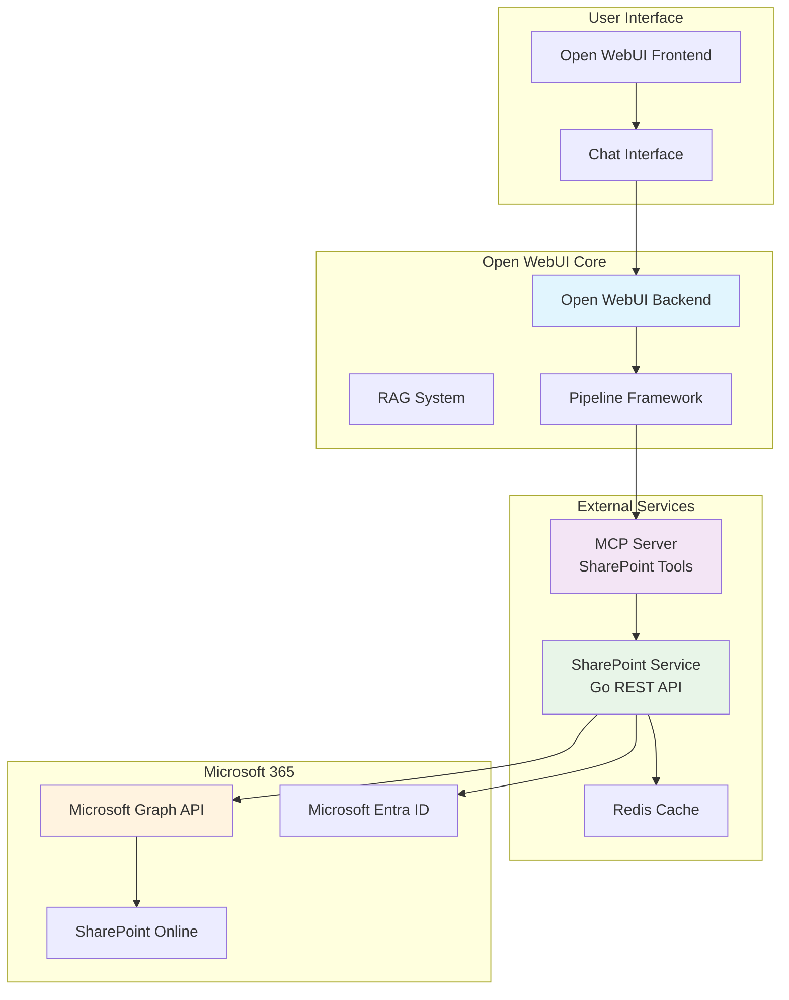
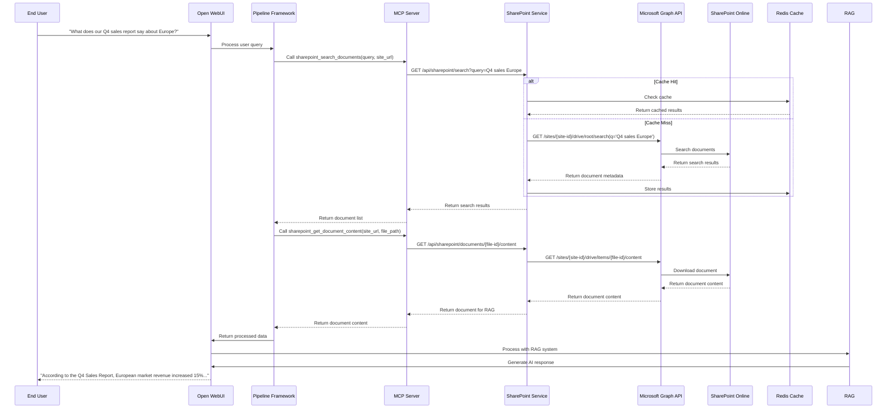

# Open WebUI SharePoint Integration Plan

## Executive Summary

This document outlines a comprehensive strategy for integrating Open WebUI with Microsoft SharePoint using modern microservices architecture and the Model Context Protocol (MCP). The integration leverages Open WebUI's existing extensibility framework to provide seamless SharePoint document access, search, and AI-powered analysis without modifying the core Open WebUI codebase.

### Key Objectives
- **Zero Open WebUI Modifications**: Preserve upstream update compatibility
- **Seamless User Experience**: Natural language SharePoint queries through chat interface
- **Enterprise Security**: Microsoft Entra ID authentication and role-based access control
- **Scalable Architecture**: Independent microservices for easy maintenance and scaling
- **Modern Protocol Support**: MCP (Model Context Protocol) for tool integration

### Business Value
- **Enhanced Productivity**: AI-powered document discovery and analysis
- **Reduced Manual Work**: Automated document processing and insights generation
- **Improved Collaboration**: Real-time document sharing and team coordination
- **Cost Efficiency**: Leverage existing SharePoint infrastructure with minimal additional overhead

## Solution Architecture

### High-Level Architecture Diagram



### Service Communication Flow



## Implementation Strategy

### Phase 1: External SharePoint Service (Go)

**Service Architecture**
```go
// SharePoint Service - Independent Go microservice
type SharePointService struct {
    graphClient    *graph.Client
    sharePointAPI  *sharepoint.Client
    authProvider   *auth.AzureADProvider
    openapiServer  *gin.Engine
    cache          *redis.Client
    config         *Config
}

// REST API Endpoints
func (s *SharePointService) setupRoutes() {
    api := s.openapiServer.Group("/api/sharepoint")
    
    // Document Management
    api.GET("/documents", s.listDocuments)
    api.GET("/documents/:id", s.getDocument)
    api.GET("/documents/:id/content", s.getDocumentContent)
    api.POST("/documents/search", s.searchDocuments)
    
    // Site Management
    api.GET("/sites", s.listSites)
    api.GET("/sites/:id", s.getSite)
    api.GET("/sites/:id/lists", s.getLists)
    
    // List Management
    api.GET("/lists/:id", s.getList)
    api.GET("/lists/:id/items", s.getListItems)
    api.POST("/lists/:id/items", s.createListItem)
    
    // Health and Configuration
    api.GET("/health", s.healthCheck)
    api.GET("/config", s.getConfig)
}
```

**Key Features**
- **Microsoft Graph API Integration**: Full SharePoint and OneDrive access
- **OAuth 2.0 Authentication**: Microsoft Entra ID integration
- **Caching Layer**: Redis-based caching for performance
- **Rate Limiting**: Respect Microsoft API limits
- **Error Handling**: Graceful degradation and retry logic
- **Logging & Monitoring**: Comprehensive observability

### Phase 2: MCP Server for SharePoint Tools

**MCP Server Implementation**
```python
# MCP SharePoint Server - Independent Python service
class SharePointMCPServer:
    def __init__(self, sharepoint_service_url: str):
        self.sharepoint_client = SharePointClient(sharepoint_service_url)
        self.tools = {
            "sharepoint_search_documents": self.search_documents,
            "sharepoint_list_documents": self.list_documents,
            "sharepoint_get_document_content": self.get_document_content,
            "sharepoint_get_sites": self.get_sites,
            "sharepoint_get_lists": self.get_lists,
            "sharepoint_get_list_items": self.get_list_items,
        }
    
    @mcp_tool
    async def search_documents(self, query: str, site_url: str = None, 
                             folder_path: str = "/", limit: int = 10) -> List[SearchResult]:
        """Search SharePoint documents using Microsoft Search"""
        return await self.sharepoint_client.search_documents(query, site_url, folder_path, limit)
    
    @mcp_tool
    async def list_documents(self, site_url: str, folder_path: str = "/", 
                           recursive: bool = False) -> List[Document]:
        """List documents from SharePoint site/folder"""
        return await self.sharepoint_client.list_documents(site_url, folder_path, recursive)
    
    @mcp_tool
    async def get_document_content(self, site_url: str, file_path: str, 
                                 format: str = "text") -> str:
        """Retrieve document content for RAG processing"""
        return await self.sharepoint_client.get_document_content(site_url, file_path, format)
    
    @mcp_tool
    async def get_sites(self, search: str = None) -> List[Site]:
        """Get SharePoint sites accessible to the user"""
        return await self.sharepoint_client.get_sites(search)
    
    @mcp_tool
    async def get_lists(self, site_url: str) -> List[SharePointList]:
        """Get SharePoint lists from a site"""
        return await self.sharepoint_client.get_lists(site_url)
    
    @mcp_tool
    async def get_list_items(self, site_url: str, list_name: str, 
                           query: str = None) -> List[ListItem]:
        """Get items from a SharePoint list"""
        return await self.sharepoint_client.get_list_items(site_url, list_name, query)
```

### Phase 3: Open WebUI Integration (Configuration Only)

**Configuration Management**
```yaml
# Open WebUI Configuration - External file
openapi_servers:
  - name: "SharePoint Integration"
    url: "http://sharepoint-service:8080"
    api_key: "${SHAREPOINT_SERVICE_API_KEY}"
    description: "SharePoint document and list management"
    auth_type: "bearer"
    config:
      enable: true
      access_control:
        - user_id: "*"
          permission: "read"

# Pipeline Configuration - Add via admin panel
pipelines:
  - name: "SharePoint RAG"
    type: "filter"
    url: "http://sharepoint-mcp-server:3000"
    priority: 1
    pipelines: ["*"]
```

**Docker Compose Configuration**
```yaml
version: '3.8'
services:
  openwebui:
    image: ghcr.io/open-webui/open-webui:main
    environment:
      - TOOL_SERVER_CONNECTIONS_CONFIG=/config/tool-servers.yaml
    volumes:
      - ./config:/config
    ports:
      - "3000:8080"

  sharepoint-service:
    build: ./services/sharepoint
    ports:
      - "8081:8080"
    environment:
      - MICROSOFT_CLIENT_ID=${MICROSOFT_CLIENT_ID}
      - MICROSOFT_CLIENT_SECRET=${MICROSOFT_CLIENT_SECRET}
      - MICROSOFT_TENANT_ID=${MICROSOFT_TENANT_ID}
      - REDIS_URL=redis://redis:6379
    depends_on:
      - redis

  sharepoint-mcp-server:
    build: ./services/sharepoint-mcp
    ports:
      - "3001:3000"
    environment:
      - SHAREPOINT_SERVICE_URL=http://sharepoint-service:8080
    depends_on:
      - sharepoint-service

  redis:
    image: redis:7-alpine
    ports:
      - "6379:6379"
    volumes:
      - redis_data:/data

volumes:
  redis_data:
```

## User Experience Scenarios

### Scenario 1: Document Search and Q&A
```
User: "What does our Q4 sales report say about the European market?"

System Response:
"According to the Q4 Sales Report (SharePoint), European market revenue increased 15% 
compared to Q3, with Germany leading at €2.3M. Key highlights:
- Total European revenue: €8.7M
- Top performing countries: Germany (€2.3M), France (€1.8M), UK (€1.5M)
- Growth drivers: New product launches and expanded distribution channels
- Challenges: Supply chain delays in Eastern Europe

The report also mentions plans for Q1 expansion into Poland and Czech Republic."
```

### Scenario 2: Document Discovery
```
User: "Show me all documents about cybersecurity from last month"

System Response:
"I found 12 documents about cybersecurity from last month:

📄 Security Policy Updates (Dec 15, 2023)
📄 Incident Response Plan v2.1 (Dec 12, 2023)
📄 Cybersecurity Training Materials (Dec 8, 2023)
📄 Vendor Security Assessment (Dec 5, 2023)
📄 Network Security Audit Report (Dec 3, 2023)
... and 7 more documents

Would you like me to summarize any specific document or provide insights across all of them?"
```

### Scenario 3: Real-time Document Updates
```
User: "What's the latest version of our company policy?"

System Response:
"The latest version of the Company Policy is v3.2, updated on December 18, 2023. 
Key changes from the previous version (v3.1):

🔄 Updated remote work guidelines
🔄 New data protection requirements
🔄 Revised expense reporting procedures
🔄 Enhanced security protocols

The document has been viewed 47 times and downloaded 12 times since the update. 
Would you like me to highlight the specific changes or answer questions about any section?"
```

### Scenario 4: List Data Analysis
```
User: "What's the status of our current projects?"

System Response:
"Based on the Project Tracker list, here's the current status:

🟢 On Track (8 projects):
- Website Redesign - 85% complete
- Mobile App Development - 72% complete
- Database Migration - 90% complete

🟡 At Risk (3 projects):
- CRM Integration - 45% complete (delayed due to vendor issues)
- Security Audit - 60% complete (waiting for external review)

🔴 Behind Schedule (1 project):
- Cloud Migration - 30% complete (technical challenges)

Overall project health: 73% of projects are on track or ahead of schedule."
```

## Technical Implementation Details

### MCP (Model Context Protocol) Integration

**MCP Protocol Benefits**
- **Standardized Tool Interface**: Consistent API for SharePoint operations
- **Type Safety**: Strong typing for all tool parameters and responses
- **Extensibility**: Easy to add new SharePoint tools without code changes
- **Interoperability**: Compatible with other MCP-enabled systems

**MCP Tool Definitions**
```json
{
  "tools": [
    {
      "name": "sharepoint_search_documents",
      "description": "Search SharePoint documents using Microsoft Search",
      "inputSchema": {
        "type": "object",
        "properties": {
          "query": {
            "type": "string",
            "description": "Search query"
          },
          "site_url": {
            "type": "string",
            "description": "SharePoint site URL (optional)"
          },
          "folder_path": {
            "type": "string",
            "description": "Folder path to search in (default: /)"
          },
          "limit": {
            "type": "integer",
            "description": "Maximum number of results (default: 10)"
          }
        },
        "required": ["query"]
      }
    }
  ]
}
```

### Authentication and Security

**Microsoft Entra ID Integration**
```go
// Authentication provider for Microsoft Graph API
type AzureADProvider struct {
    clientID     string
    clientSecret string
    tenantID     string
    scopes       []string
}

func (a *AzureADProvider) GetAccessToken() (string, error) {
    // Implement OAuth 2.0 client credentials flow
    // Request token with appropriate SharePoint scopes
    // Handle token refresh and caching
}

// Required Microsoft Graph API Scopes
var requiredScopes = []string{
    "Sites.Read.All",      // Read SharePoint sites
    "Files.Read.All",      // Read files and folders
    "Sites.Search.All",    // Search SharePoint content
    "User.Read",           // Read user profile
}
```

**Security Features**
- **OAuth 2.0 Authentication**: Secure Microsoft Entra ID integration
- **Role-Based Access Control**: Granular permissions per user/group
- **API Key Management**: Secure service-to-service communication
- **Data Encryption**: End-to-end encryption for sensitive data
- **Audit Logging**: Comprehensive activity tracking

### Performance Optimization

**Caching Strategy**
```go
// Redis-based caching for SharePoint operations
type CacheManager struct {
    redis *redis.Client
    ttl   time.Duration
}

func (c *CacheManager) GetCachedDocuments(query string) ([]Document, error) {
    // Check cache for search results
    // Return cached data if available and fresh
    // Fall back to API call if cache miss
}

func (c *CacheManager) CacheDocuments(query string, documents []Document) error {
    // Store search results in cache with TTL
    // Implement cache eviction policies
}
```

**Rate Limiting**
```go
// Rate limiting for Microsoft Graph API calls
type RateLimiter struct {
    requestsPerMinute int
    burst            int
    limiter          *rate.Limiter
}

func (r *RateLimiter) WaitForToken() error {
    // Implement token bucket algorithm
    // Respect Microsoft Graph API rate limits
    // Provide graceful degradation
}
```

## Deployment and Configuration

### Environment Variables
```bash
# SharePoint Service Configuration
MICROSOFT_CLIENT_ID=your-client-id
MICROSOFT_CLIENT_SECRET=your-client-secret
MICROSOFT_TENANT_ID=your-tenant-id

# Service URLs
SHAREPOINT_SERVICE_URL=http://sharepoint-service:8080
SHAREPOINT_MCP_SERVER_URL=http://sharepoint-mcp-server:3000

# Redis Configuration
REDIS_URL=redis://redis:6379
REDIS_PASSWORD=your-redis-password

# Open WebUI Configuration
TOOL_SERVER_CONNECTIONS_CONFIG=/config/tool-servers.yaml
```

### Health Checks and Monitoring
```yaml
# Health check endpoints
health_checks:
  - name: "SharePoint Service"
    url: "http://sharepoint-service:8080/api/sharepoint/health"
    interval: 30s
    timeout: 5s
    
  - name: "MCP Server"
    url: "http://sharepoint-mcp-server:3000/health"
    interval: 30s
    timeout: 5s
    
  - name: "Microsoft Graph API"
    url: "https://graph.microsoft.com/v1.0/me"
    interval: 60s
    timeout: 10s
```

## Implementation Roadmap

### Phase 1: Foundation (Weeks 1-4)
**Week 1-2: Development Environment Setup**
- Set up Go development environment
- Configure Microsoft Entra ID application
- Set up Redis and monitoring infrastructure
- Create Docker Compose development environment

**Week 3-4: SharePoint Service Core**
- Implement Microsoft Graph API client
- Build authentication provider
- Create REST API endpoints
- Implement caching and rate limiting
- Add comprehensive logging and error handling

### Phase 2: MCP Integration (Weeks 5-6)
**Week 5: MCP Server Development**
- Implement MCP protocol server
- Create SharePoint tool definitions
- Build tool execution logic
- Add parameter validation and error handling

**Week 6: Integration Testing**
- Test MCP server with SharePoint service
- Validate tool functionality
- Performance testing and optimization
- Security testing and validation

### Phase 3: Open WebUI Integration (Weeks 7-8)
**Week 7: Configuration and Setup**
- Configure Open WebUI tool server connections
- Set up pipeline integration
- Test end-to-end functionality
- User acceptance testing

**Week 8: Documentation and Deployment**
- Complete documentation
- Create deployment guides
- Production deployment
- User training and support

### Phase 4: Advanced Features (Weeks 9-12)
**Week 9-10: Enhanced Functionality**
- Implement advanced search capabilities
- Add document versioning support
- Create list data analysis tools
- Build real-time notification system

**Week 11-12: Optimization and Scaling**
- Performance optimization
- Load testing and scaling
- Security hardening
- Production monitoring setup

## Risk Assessment and Mitigation

### High-Risk Items

1. **Microsoft API Rate Limits**
   - **Risk**: Exceeding Microsoft Graph API rate limits
   - **Mitigation**: Implement robust caching and rate limiting
   - **Monitoring**: Track API usage and implement alerts

2. **Authentication Complexity**
   - **Risk**: OAuth 2.0 implementation challenges
   - **Mitigation**: Use proven Microsoft authentication libraries
   - **Testing**: Comprehensive authentication testing

3. **Service Dependencies**
   - **Risk**: External service availability issues
   - **Mitigation**: Implement circuit breakers and fallback mechanisms
   - **Monitoring**: Service health checks and alerting

4. **Data Security**
   - **Risk**: Sensitive document exposure
   - **Mitigation**: Implement role-based access control
   - **Audit**: Comprehensive logging and monitoring

### Mitigation Strategies

- **Caching Layer**: Redis-based caching for API responses
- **Fallback Mechanisms**: Graceful degradation when services unavailable
- **Service Health Checks**: Implement health checks and circuit breakers
- **Configuration Validation**: Automated validation of service configurations
- **Comprehensive Testing**: Unit, integration, and end-to-end testing
- **Monitoring & Alerting**: Centralized monitoring for all services
- **Documentation**: Maintain clear documentation for service integration

## Success Metrics

### Technical Metrics
- **API Response Time**: < 2 seconds for SharePoint operations
- **Service Uptime**: 99.9% availability for all services
- **Cache Hit Rate**: > 80% for frequently accessed documents
- **Error Rate**: < 1% for SharePoint API calls
- **Authentication Success Rate**: > 99% for user authentication

### Business Metrics
- **User Adoption**: > 70% of users actively using SharePoint integration
- **Query Volume**: > 1000 SharePoint queries per day
- **Document Discovery**: > 50% improvement in document findability
- **Time Savings**: > 30% reduction in manual document search time
- **User Satisfaction**: > 4.5/5 rating for SharePoint integration

## Conclusion

This SharePoint integration plan provides a comprehensive roadmap for seamlessly connecting Open WebUI with Microsoft SharePoint using modern microservices architecture and the Model Context Protocol. The approach ensures zero modifications to the Open WebUI codebase while providing powerful SharePoint document access and AI-powered analysis capabilities.

The implementation leverages Open WebUI's existing extensibility framework through tool servers and pipelines, making it easy to deploy, maintain, and scale. The use of MCP provides a standardized interface for SharePoint operations while maintaining type safety and extensibility.

Key benefits of this approach include:
- **Preserved Open Source Benefits**: Easy upstream updates and community contributions
- **Enterprise-Grade Security**: Microsoft Entra ID integration with role-based access control
- **Scalable Architecture**: Independent services that can be scaled based on demand
- **Modern Protocol Support**: MCP integration for future extensibility
- **Comprehensive User Experience**: Natural language SharePoint queries through chat interface

The phased implementation approach ensures manageable development cycles with regular testing and validation, reducing risk and ensuring successful delivery of the integration. 